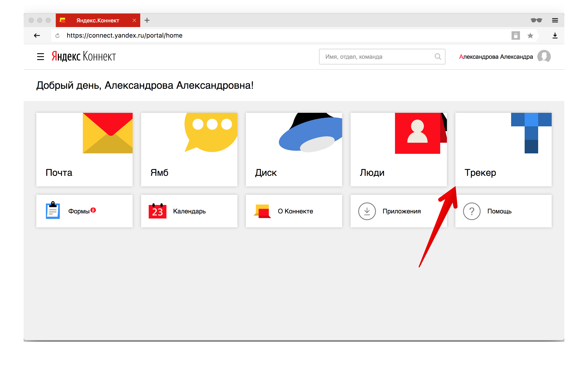
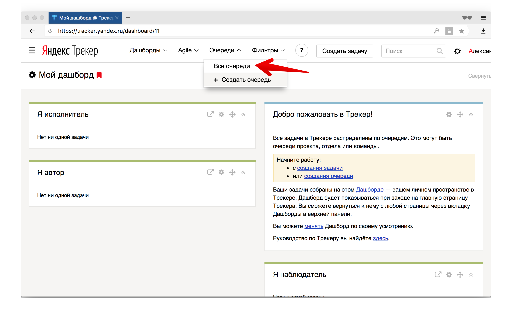
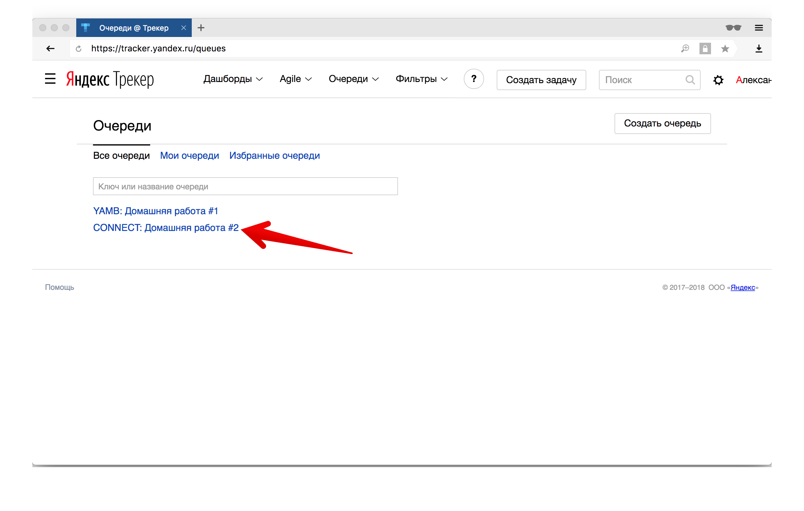
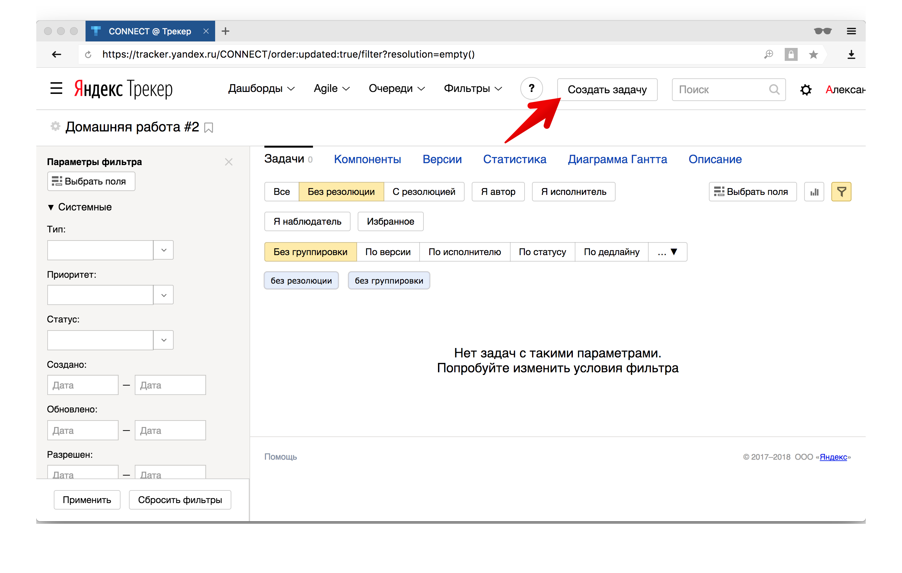

# Домашняя работа #2

## Формулировка
Сформулировать 5 позитивных и 1 негативный
тест кейс на страницу https://connect.yandex.ru/
при условии, что пользователь залогинен.

## Как сдать
1. Переходим https://connect.yandex.ru/ и логинимся
  используя учетную запись, которую мы отправили вам в письме.
  Если у вас нет логина, напишите на почту y.students@yandex.ru
2. Выбираем плитку "Трекер"
  
3. Во вкладке "Очереди" выбираем "Все очереди"
  
4. Выбираем пункт "CONNECT: Домашняя работа #2"
  
5. Нажимаем кнопку "Создать задачу"
  
6. Заполняем решение задачи и нажимаем "Создать"